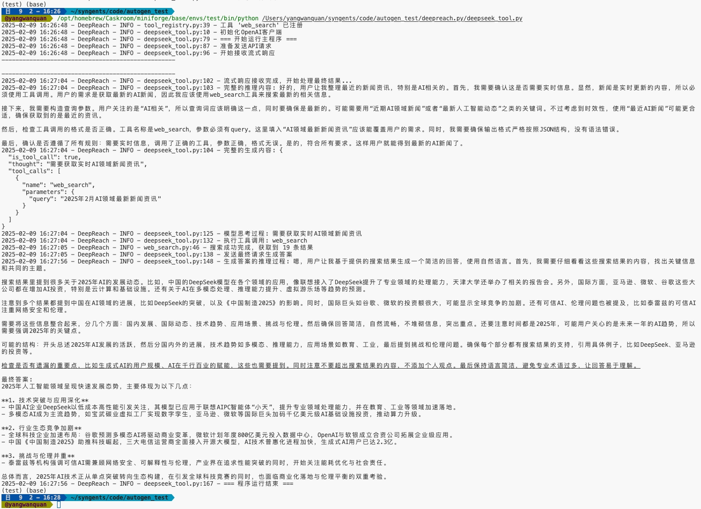

# 自定义LLM工具调用框架

这个示例展示了如何在推理模型不原生支持工具调用和结构化输出的情况下，通过提示词工程和自定义框架来实现类似GPT-4o的工具调用能力。

## 🌟 特点

- 🛠 自定义工具调用框架 - 实现类似ChatGPT的工具调用能力
- 📝 结构化JSON输出控制 - 通过提示词引导模型生成规范化输出
- 🔄 流式响应处理 - 支持实时响应流处理
- 🧠 会话管理 - 智能维护对话上下文
- 📊 灵活的工具注册机制 - 便捷的工具注册和管理系统

## 🏗 组成

项目由以下核心组件构成：

1. **deepseek_tool.py**: 主程序入口，包含了对话管理、流式响应处理和工具调用的核心逻辑
2. **tool_registry.py**: 工具注册中心，管理所有可用工具的注册和调用
3. **web_search.py**: 示例工具实现，提供网络搜索功能
4. **logger_config.py**: 日志配置模块，提供统一的日志记录功能

## 环境配置

### 创建并激活Conda环境
```bash
创建新的conda环境
conda create -n llm_tools python=3.9
conda activate llm_tools
```

### 安装依赖
```bash
pip install openai
pip install requests
```

### 配置环境变量，替换成各个平台的deepseek R1的API_KEY和BASE_URL
```bash
export OPENAI_API_KEY="your-api-key"
export OPENAI_BASE_URL="your-base-url"
```

## 运行示例
```bash
激活环境
conda activate llm_tools
运行主程序
python deepseek_tool.py
```

### 运行效果


## 文件说明

### deepseek_tool.py
主程序文件，实现了：
- 对话管理器（ConversationManager）
- 流式响应处理
- 工具调用的核心逻辑
- 系统提示词构建

### tool_registry.py
工具注册中心，负责：
- 工具的注册和管理
- 工具调用的执行
- 系统提示词的工具部分生成

### web_search.py
示例工具实现，展示了：
- 如何注册新工具
- 工具参数定义
- 工具执行逻辑

### logger_config.py
日志配置模块，提供：
- 统一的日志记录接口
- 可配置的日志级别
- 格式化的日志输出

## 工具调用流程

1. 系统通过提示词定义工具格式和调用规则
2. 模型生成符合格式的JSON响应
3. 框架解析响应并执行相应工具
4. 工具执行结果返回给模型
5. 模型生成最终自然语言回答

## 自定义新工具

要添加新的工具，需要：

1. 创建新的工具函数
2. 使用`@registry.register_tool`装饰器注册工具
3. 定义工具的参数和描述

示例：
python
from tool_registry import registry
@registry.register_tool(
name="search",
description="搜索互联网信息",
parameters={
"query": "搜索关键词",
"limit": "返回结果数量"
}
)
def web_search(parameters):
# 工具实现逻辑
pass

## 注意事项

- 确保API密钥和基础URL配置正确
- 工具返回的结果应该是可JSON序列化的
- 建议在开发新工具时先使用debug日志级别测试

## 贡献指南

欢迎提交Pull Request来改进项目。请确保：
1. 代码符合PEP 8规范
2. 添加适当的注释和文档
3. 包含必要的测试用例

## 许可证

MIT License

## 🔮 未来探索方向

### 混合推理模型组合
- 实现多个推理模型组合协作，充分利用不同模型的优势
- 在有限上下文窗口下实现类似OpenAI的deep research效果
- 探索模型间的任务分配和结果整合策略

具体可以探索：
1. **分层推理架构**
   - 使用轻量模型处理初步分析和任务分发
   - 专业模型负责深度推理和专业领域问题
   - 整合模型完成最终答案生成

2. **动态上下文管理**
   - 实现智能的上下文压缩和筛选
   - 根据问题特点动态调整上下文窗口
   - 设计高效的多轮对话记忆机制

3. **深度搜索增强**
   - 实现递归式的深度搜索
   - 智能合并多源信息
   - 构建知识图谱辅助推理

欢迎感兴趣的朋友一起玩。